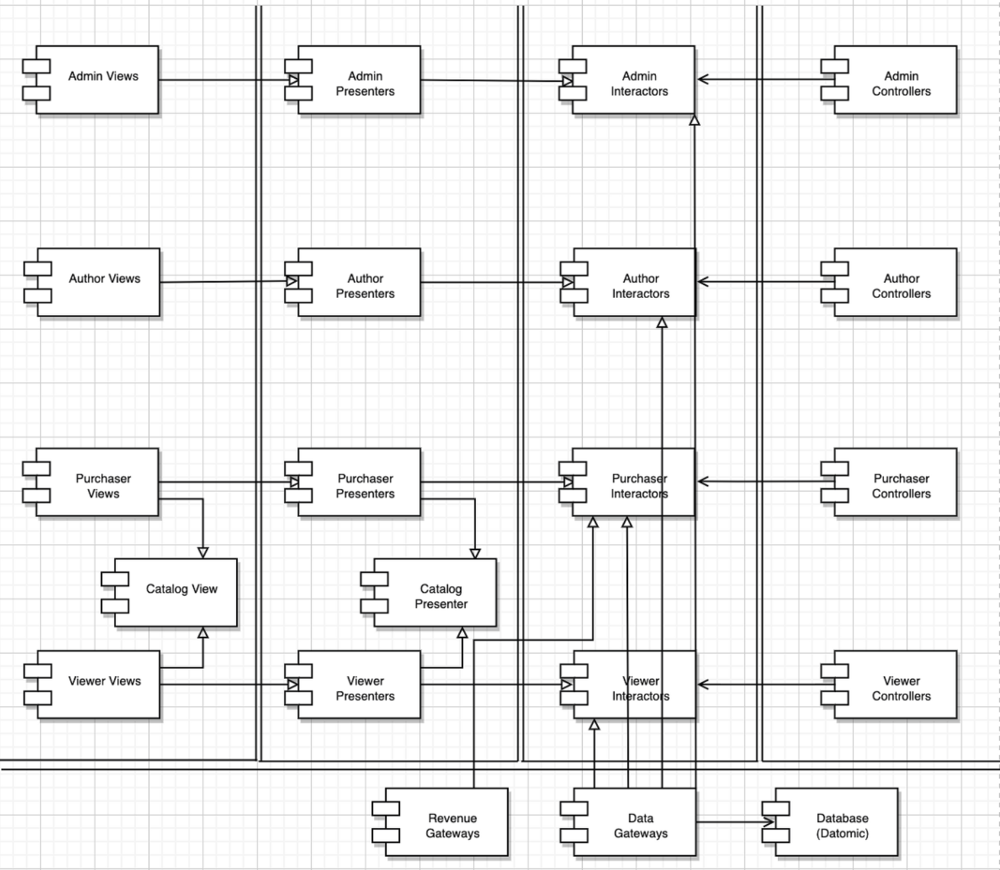

# 30장 데이터베이스는 세부사항이다

> TL;DR  
> - "데이터"가 중요하지 "데이터 베이스"가 중요한 것은 아니다.
> - 데이터 공부를 하고 싶다고 디비 공부를 해야하는 것이 아니다.


- 데이터베이스는 엔티티가 아니라 데이터에 접근할 도구일 뿐이다.
- 즉 아키텍처 관점에서 데이터 베이스는 세부사항일 뿐 관련이 있는 것이 아니다.

## 관계형 데이터베이스
- 데이터를 저장, 접근에 용이한 "기술" -> 즉 세부사항
- 데이터가 테이블 구조를 가진다는 사실은 "오직" 아키텍처의 외부 원에 위치한 최하위 수준의 유틸리티 함수만 알아야 한다.
- 테이블과 행이 객체 형태를 갖고 활용되는 것은 잘못된 설계다.

Q.그치만 우린 평소에 orm을 쓸 때 그것을 entity마냥 쓸 때가 많지 않나요..?
아무래도 microservice가 되면서 그렇게 되는 것 같아요. 예전에는 다 같은 디비를 접근하기 때문에 따로 entity class를 만들어서 활용할 곳에 맞게 사용했는데(이게 entity layer?!), 요즘은 또 다른 것 같습니다. (feat. microservice 를 구현할 때 사용하는 cqrs)


## 데이터베이스 시스템은 왜 이렇게 널리 사용되는가?
- '디스크'가 느렸던 시절 데이터 접근 및 관리 시스템이 필요
    - 해결책 2가지 종류
        - 파일 시스템
            - 문서 기반이다 보니 내용 기준 검색이 오래 걸린다.
        - 관계형 데이터베이스 관리 시스템
            - 다수의 레코드를 연관 짓는데 적합해 내용 기준 검색은 편리하나, 정형화되지 않은 문서를 저장하고 검색하는 것은 대체로 부적합
    - 두 해결책 모두 디스크를 체계화해 효율적으로 데이터를 저장하고 검색하게 하기 위해 사용한다.
- 그러나 결국 빠르게 조작할 수 있도록 RAM을 함께 사용한다.


## 디스크가 없다면 어떻게 될까?
- 디스크는 RAM으로 대체되고 있다.
- 데이터를 테이블 구조로 만들어 SQL을 이용해 접근하지 않고, 이미 다양한 임의의 구조로 사용하고 있다.
- 따라서 데이터베이스는 디스크와 RAM 사이에서 데이터를 옮길 때만 사용함으로 세부사항이다.

*Q. orm을 쓸 때 one to many를 쓸 때 list형태로 저장하는 그런 것을 얘기하는 것 같아용. 다른분들은 어떤생각?*


## 성능은?
- 성능은 시스템의 전반적인 아키텍처와 아무 관련 없다...!?!?


# 31장 웹은 세부사항

> TL;DR  
> - 격동의 웹(!) 연산을 중앙 집중하는 방식과 분산하는 방식 두 사이를 우리는 계에에에속 움직인다.
> - 웹은 단지 입출력장치일 뿐이니, 유스케이스를 실행하는 처리 과정의 입출력값을 사용 하는 것에 집중하자.


# 32장 프레임워크는 세부사항

> TL;DR  
> - 프레임워크는 제품에 꼭 맞게 만들어 주지도 않는다.
> - 즉 사용시 자신이 구현하고자 하는 제품에 꼭 맞게 추상화를 해서 가져오는 것이 더 안전하다.

*Q.맥락이 살짝 다르긴 하지만 이와 비슷한 사례가 orm이지 않을까? 어떤 디비를 사용하든 코드는 바뀌지 않으니까. 근데 프레임워크도 그렇게 될 수 있나...? 예전에 꽤 큰 회사에서 angular, react, vue의 격동 시기 덕분에 많이 빡쳤던 웹 프론트 분들이 그런식으로 했었다는 얘기를 들은 적이 있다.*
 - 최대한 표준 라이브러리를 사용하자.


# 33장 사례연구: 비디오 판매

> TL;DR
> 1. actor와 유스케이스 분석
> 2. 컴포넌트 아키텍처 만들기

## 첫번째 유스케이스 분석


- 일단 단일 책임 원칙을 따르며 4개의 actor로 나눈다.
- 각 actor들이 어떤 기능을 하는지 정리한다.
- 범용적인 정책을 담고 있으면, 점선으로 처리된 원처럼 추상 유스케이스를 만든다.
    - 반드시 필요 한 것 x

## 컴포넌트 아키텍처
두가지를 보여준다.  
- 단일 책임 원칙에 기반한 액터 분리
- 의존성 규칙 




- 가로로 보면 액터같고, 세로로 보면 컴포넌트의 종류가 같다.(뷰, 프레젠터, 인터랙터, 컨트롤러)
- 각 컴포넌트를 독립적으로 컴파일하고 빌드할 수 있는 환경을구성하면 후에 시스템이 변경되는 양상에 맞춰 시스템 배포 방식 조정 가능
- 서로다른이유(액터의 분리), 서로다른속도(정책 수준)로 두가지 서로 다른 차원의 분리 개념을 포함


# 34장 빠져있는 장
> TL; DR 
> 최적의 설계 했더라도, 구현 전략에 얽힌 복잡함을 고려하지 않으면 설계는 순식간 망가진다.

## 계층 기반 패키지
- 기술적인 관점에서 해당코드가 하는일(controller, service, repository)에 기반해서 그 코드를 계층으로 분할하는것을 계층기반 패키지
- 업무 도메인에 대해서 말을 해주지 않아 문제


## 기능 기반 패키지
- 서로 연관된 기능, 도메인 개념, 또는 Aggregate Root에 기반하여 수직의 얇은 조각으로 코드를 나누는 방식
- 인터페이스와 클래스는 이전과 같지만 모두가 order라는 단 하나의 패키지에 속하게 됨.
- 상위 수준 구조가 업무 도메인에 대해 무엇인가를 알려주게됨.
- 또한 '주문 조회하기' 유스케이스가 변경될 경우 order라는 한 패키지만 찾으면되기 때문에 수월해짐.


## 포트와 어댑터
- com.mycompany.myapp.domain 패키지가 '내부' 도메인 이며 나머지 패키지는 '외부'
- 추가로 Orders는 OrdersRepository라는 이름에서 바뀐 이름인데 DDD에서는 유비쿼터스 도메인 언어를 관점으로 기술하라고 했기때문에 반영된 것.
- 예를들면 도메인에 대해 논의할 때 '주문'에 대해 말하는것이지 '주문 레파지토리'에 대해 말하는것이 아니기 때문임.

## 컴포넌트 기반 패키지
- 컴포넌트 기반패키지에서도 사용자 인터페이스를 큰 단위의 컴포넌트로 분리.
- '업무로직'과 영속성 관련 코드를 컴포넌트로써 하나로 묶음.
- 컴포넌트 기반 패키지 접근법의 주된 이점은 Orders와 관련된 무언가를 코딩할 때 오직 OrderComponent만 둘러보면 됨.
- 업무로직과 영속성 코드가 포함된 컴포넌트 내부의 관심사 분리는 여전히 유효(업무로직과 영속성은 분리되어있음) 함. 


## 구현 세부사항엔 항상 문제가 있다.
- java가 말이야 public 접근 지시자 써서 캡슐화 다 망쳐놨어 빼액
- 왜냐면 public 지시자를 과용하면 이 장의 앞에서 제시한 네 가지 아키텍처 접근법은 본질적으로 같아짐.


## 다른 결합 분리 모드
- 소스코드 수준에서 의존성을 분리

포트와 어댑터로 예로들면 
``` 

1. 업무와 도메인용 소스 코드: OrderSerivce, OrdersServiceImpl, Orders
2. 웹용 소스 코드: OrdersController
3.데이터 영속성용 소스 코드: JdbcOrderRepository

```
2, 3번 두 소스 트리는 컴파일 시점에서 업무와 도메인용 소스코드에 의존성을 가지며 업무와 도메인용 소스코드는 웹, 데이터영속성 코드에 대해 알지 못함.

 

이렇게 분리하려면 → 1, 2, 3 각각은 Maven, Gradle 같은 도구로 서로 분리되도록 구성해야함.  
이상적인 해결책이지만 이렇게 나누다 보면 성능, 복잡성, 유지보수 문제에 부딪힘.  


더 간단한 방법은  

1. 도메인 코드('내부')  
2. 인프라 코드('외부')  
로 나누기  


인프라는 도메인에 대해 컴파일시점에 의존성을 가짐.  

단점으로는 페리페리크(프랑스에있는 원형 순환도로로써 북적대는 파리시내에 진입하지 않고도 파리 전체를 둘러볼 수 있음) 안티패턴임.  

즉, 특정영역(인프라코드중 웹 컨트롤러 부분)이 애플리케이션의 다른 영역에 있는 코드를 도메인 코드를 통하지않고 직접 호출할 수 있음.  

(적절한 접근 지시자 적용을 잊어버렸다면 더욱 막기 힘듦.)  


---  
이미지 출처: 
https://hwannny.tistory.com/52  
https://hwannny.tistory.com/51  
